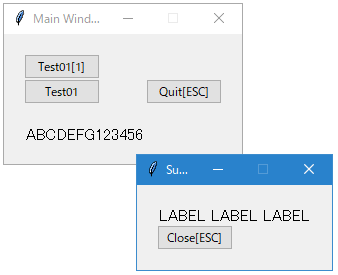

# simpletkgrid: Tkinter Simple Grid Library

## Installation

```bash
pip install git+https://github.com/kihiyuki/python-simpletkgrid.git
```

## Examples

[example/](example/)

### Simple Example

```python
from src.simpletkgrid import RootWindow, SubWindow

def main() -> None:
    def _testwindow01(event=None):
        w = SubWindow(title="Sub Window 01")
        w.labels.add("LABEL LABEL LABEL")
        w.buttons.add("Close[ESC]", w.close)
        w.bind("<Escape>", w.close)

    root = RootWindow(title="Main Window")
    root.buttons.add("Test01[1]", _testwindow01, fullspan=True)
    root.buttons.add("Test01", _testwindow01)
    root.buttons.add("Quit[ESC]", root.close)
    root.lf(2)
    root.labels.add("ABCDEFG123456")

    root.bind("1", _testwindow01)
    root.bind("<Escape>", root.close)

    root.mainloop()

if __name__ == "__main__":
    main()
```


